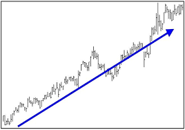

Technical Analysis is the study of market action, primarily through the use of charts, for the
purpose of forecasting future price trends.

###PHILOSOPHY OR RATIONALE
1. Market action discounts everything.

The technician believes that anything can possibly affect the price- fundamentally, politically,
psychologically, or otherwise--is actually reflected in the price of that market.
All of the technical tools discussed later on are simply techniques users to aid the chartist
knows there are reasons why markets go up or down. He or she just doesn't believe that knowing what those reasons are is necessary in the forecasting process.
2. Prices move in trends.

Example of an uptrend. Technical analysis is based on the premise that markets trend and that those trends tend to persist.
corollary: **A trend in motion is more likely to continue than to reverse.**

3. History repeats itself.
The key to understanding the future lies in a study of the past, or that the future is just a repetition of the past.

###TECHNICAL VERSUS FUNDAMENTAL FORECASTING

*The fundamentalist studies the cause of market movement, while the technician studies
the effect.* The technician , of course, believe that the effect is all that he or she wants
or needs to know and that the reasons, or the causes, are unnecessary. The fundamentalist always
has to know why.
Market price acts as a leading indicator of the fundamentals.

###ANALYSIS VERSUS TIMING
###FLEXIBILITY AND ADAPTABILITY OF TECHNICAL ANALYSIS
###TECHNICAL ANALYSIS APPLIED TO DIFFERENT TRADING MEDIUMS
###TECHNICAL ANALYSIS APPLIED TO DIFFERENT TIME DIMENSIONS
It has been suggested by some that fundamental analysis should be used for long term forecasting with technical factors limited to short term timing. The fact is that longer range
forecasting, using weekly and monthly charts going back several years, has proven to be
an extremely useful application on these techniques.
###LESS RELIANCE ON MARKET AVERAGES AND INDICATORS
Stock market analysis is based heavily on the movement of broad market averages--
such as the Dow Jones Industrial Average or the S&P 500. In addition, technical indicators that measure the strength or weakness of the broader market-- like the NYSE advance-decline line or the new highs-new lows list--are heavily employed. 
