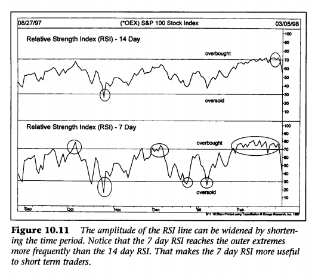

Technical Analysis is the study of market action, primarily through the use of charts, for the
purpose of forecasting future price trends.
##Chapter 1. Philosophy of Technical Analysis
###PHILOSOPHY OR RATIONALE
1. Market action discounts everything.

The technician believes that anything can possibly affect the price- fundamentally, politically,
psychologically, or otherwise--is actually reflected in the price of that market.
All of the technical tools discussed later on are simply techniques users to aid the chartist
knows there are reasons why markets go up or down. He or she just doesn't believe that knowing what those reasons are is necessary in the forecasting process.
2. Prices move in trends.

Example of an uptrend. Technical analysis is based on the premise that markets trend and that those trends tend to persist.
corollary: **A trend in motion is more likely to continue than to reverse.**

3. History repeats itself.
The key to understanding the future lies in a study of the past, or that the future is just a repetition of the past.

###TECHNICAL VERSUS FUNDAMENTAL FORECASTING

*The fundamentalist studies the cause of market movement, while the technician studies
the effect.* The technician , of course, believe that the effect is all that he or she wants
or needs to know and that the reasons, or the causes, are unnecessary. The fundamentalist always
has to know why.
Market price acts as a leading indicator of the fundamentals.

###ANALYSIS VERSUS TIMING
###FLEXIBILITY AND ADAPTABILITY OF TECHNICAL ANALYSIS
###TECHNICAL ANALYSIS APPLIED TO DIFFERENT TRADING MEDIUMS
###TECHNICAL ANALYSIS APPLIED TO DIFFERENT TIME DIMENSIONS
It has been suggested by some that fundamental analysis should be used for long term forecasting with technical factors limited to short term timing. The fact is that longer range
forecasting, using weekly and monthly charts going back several years, has proven to be
an extremely useful application on these techniques.
###LESS RELIANCE ON MARKET AVERAGES AND INDICATORS
Stock market analysis is based heavily on the movement of broad market averages--
such as the Dow Jones Industrial Average or the S&P 500. In addition, technical indicators that measure the strength or weakness of the broader market-- like the NYSE advance-decline line or the new highs-new lows list--are heavily employed.

##Chapter 2. Dow Theory
###BASIC TENETS
1. The Averages Discount Everything.
2. The Market Has Three Trends.
Dow believes that the law of action and reaction apply to the markets just as they do to the physical universe. He wrote, "Records of trading show that in many cases when a stock reaches top it will have a moderate decline and then go back again to near the highest figures. If after such a move, the price again recedes, it is liable to decline some distance". Dow considered a trend to have three parts, *primary*, *secondary*, and *minor*, which he compared to the tide, waves. and ripples of the sea.
3. Major Trends Have Three Phases.

Accumulation phase:

Participation phase:

Distribution phase:
4. The Averages Must Confirm Each Other.
Dow meant that no important bull or bear market signal could take place unless both averages gave the same signal, thus confirming each other.
5. Volume Must Confirm the Trend.

Dow recognized volume as a secondary but important factor in confirming price signals. Simply stated, *volume should expand or increase in the direction of the major trend*.

6. A Trend Is Assumed to Be in Effect Until It Gives Definite Signals That It Has Reversed.

It relates a physical law to market movement, which states that an object in motion (in this case a trend) tends to continue in
motion until some external force causes it to change direction.

The most difficult task for a Dow theorist, or any trend-follower for that matter, it being able to distinguish between a normal
secondary correction in an existing trend and the first leg of a new trend in the opposite direction.

**THE USE OF CLOSING PRICES AND THE PRESENCE OF LINES**
Dow relied exclusively on *closing prices*. He believed that averages had to close higher than a previous peak or lower than a previous trough to have significance.

##Chapter 4. Basic Concepts of Trend

**DEFINITION OF TREND**
In a general sense, the trend is simply the direction of the market, which way it's moving. Market moves are characterized by a series of *zigzags*.
These zigzags resemble a series of successive waves with fairly obvious
peaks and troughs. *It is the direction of those peaks and troughs that constitutes market trend*.

**TREND HAS THREE DIRECTIONS**

We've mentioned an uptrend, downtrend, and sideways trend for a very good reason. Most technical tools and systems are trend-following in nature, which means that they are primarily designed for markets that are moving up or down, They usually work very poorly, or not at all, when markets enter these lateral or "trendless" phases.

There are three decisions confronting the trader-- whether to buy a market, sell a market, or do nothing. When a market is rising, the buying strategy is preferable. When it is falling, the second approach would be correct. However, when the market is moving sideways, the third choice-- to stay out of the market-- is usually the wisest.

**TREND HAS THREE CLASSIFICATION**

1. Major,
2. Intermediate, and
3. Near term trends.

Each trend becomes a portion of its next larger trend.

As a general statement, most trend-following approaches focus on the intermediate trend, which may last for several months. The near term trend is used primarily for timing purposes.
In an intermediate uptrend, short term setbacks would be used to initiate long positions.

**SUPPORT AND RESISTANCE**
The troughs, or reaction lows, are called *support*. The term is self-explanatory and
indicates that support is a level or area on the chart under the market where buying interest
is sufficiently strong to overcome selling pressure. As a result, a decline is halted and
prices turn back up again. Usually a support level is identified beforehand by a previous reaction low.

Resistance is the opposite of support and represents a price level or area over the market where
selling pressure overcomes buying pressure and a price advance is turned back. Usually a resistance
level is identified by previous peak.

**How Support and Resistance Levels Reverse Their Roles**

**The Psychology of Support and Resistance**

In a financial market, there are three types of participants, at any given price level:

- Traders who are long and waiting for price to rise
- Traders who are short and hoping that price will fall
- Traders who have not decided which way to trade

As price rises from a support level, the traders who are long are happy and may consider adding to their positions if price drops back down to the same support level. The traders who are short in this situation are beginning to question their positions, and may buy to cover (exit the position) to get out at, or near, breakeven, if price reaches the support level again. The traders who did not enter the market previously at this price level, may be ready to pounce and go long, if price comes back down to the support level. In essence, a large number of traders may be eagerly waiting to buy at this level, adding to its strength as an area of support. If all these participants do buy at this level, price will likely rebound from the support once again.

Price can, however, fall right through the support level. As price continues to drop, traders will quickly realize that the support level is not holding. The long traders may wait for price to climb back up to the previous support level, which will now act as resistance, to exit their trades in the hopes of limiting their losses. The short traders are now happy and may consider adding to their positions, if price revisits the price level. Lastly, the traders who did not enter the market yet may go short, if price comes back to the previous support level, in anticipation of price dropping further. Again, a large number of traders may be ready to make a move at this level, but now instead of buying, they will be selling. This same behavior can be witnessed in reverse with traders' reactions to resistance levels.

**The longer the period of time that prices trade in a support or resistance area, the more significant that area becomes.** For example, if prices trade sideways for three weeks in a congestion area before moving higher, that support are would be more import than if only three days of trading had occurred.

**Volume is another way to measure the significance of support and resistance.** If a support level is formed on heavy volume, this would indicate that a large number of units changed hands, and would mark that support level as more important than if very little trading had taken place. Point and figure charts that measure intraday trading activity are especially useful in identifying these price levels where most of the trading took place and, consequently, where support and resistance will be most likely to function.

**A third way to determine the significance of a support or resistance area is how recently the trading took place.**
Because  we are dealing with the reaction of traders to market movement and to positions that they have already taken or failed to take, it stands to reason that the more recent the activity, the more potent it becomes.

**Support Becoming Resistance and Vice Versa: Degree of Penetration.**
It was mentioned earlier that the distance prices traveled away from support or resistance increased the significance of that support or resistance. There is quite a bit of subjectivity involved here in determining whether a penetration is significant or not. As a benchmark, some chartists use a 3% penetration as a criteria, particularly for major support and resistance levels. Shorter term support and resistance areas would probably require a much smaller number, like 1%.

**The Importance of Round Numbers as Support and Resistance**

There  is a tendency for round numbers to stop advances or declines. Traders tend to think in terms of important round numbers, such as 10, 20, 25, 50, 75, 100 (and multiples of 1000), as price objectives and act accordingly. These round numbers, therefore, will often act as "Pyschological" support or resistance levels. A trader can use this information to begin taking profits as an important round number is approached.
One trading application of this principle is to **avoid placing trading orders right at these obvious round numbers**.
As a general rule, **avoid placing protective stops at obvious round numbers**.
In other words, protective stops on long positions should be placed below round numbers and on short positions, above such numbers.

**TRENDINESS**

An **up trendline** is a straight line drawn upward to the right along successive reaction lows. A **down trendline** is drawn downward to the right along successive rally peaks.

***Tentative Versus the valid Trendline***
In order to confirm the validity of a trendline, however, that line should be touched a third time with prices bouncing off of it.
To summarize, two points are needed to draw the trendline, and a third point to make it a valid trendline.

**How to Use the Trendline**

One f the basic concepts of trend is that a trend in motion will tend to remain in motion, As a corollary to that, once a trend assumeds a certain slope or rate of speed, as identified by the trendline, it will usually maintain the same slope. The trendline then helps not only to determine the extremities of the corrective phase, but maybe even more importantly, tells us when that trend is changing.

Very often, ***the breaking of the trendline is one of the best early warning of a change in trend***.

**How to Determine the Significance of a Trendline**

What determines the significance of a trendline? The answer to that question is twofold--*the longer it has been intact and the number of times it has been tested*.
The more significant the trendline, the more confidence it inspires and the more important is its penetration.

**Trendlines Should Include All Price Action**

Trendlines on bar charts should be drawn over or under the entire day's price range.

**How to Handle Small Trendline Penetrations**

Unfortunately, there's no hard and fast rule to follow in such a situation. Sometimes it is best to ignore the minor breach, especially if subsequent market action proves that the original line is still valid.

**What Constitutes a Valid Breaking of a Trendline?**

As a general rule, **a close beyond the trendline is more significant than
just an intraday penetration**.
There is tradeoff involved in the use of any type of filter. If the filter is too small, it won't be very useful in reducing the impact of whipsaws. If it's too big, then much of the initial move will be missed before a valid signal is given. Here again, the trader must determine what type of
filter is best suited to the degree of trend being followed, always making allowances for the differences in the individuals markets.

An alternative to a price filter is time filter. A common time filter is the **two day rule**. In other words, to have a valid breaking of a trendline, prices must close beyond trendline for two successive days. To break an up trendline, therefore, prices must close under the trendline two days in a row. A one day violation would not count. The 1-3% rule and the two day rule are also applied to breaking of important support and resistance levels, not just to major trendlines. Another filter would require a Friday close beyond a major breakout point to ensure a weekly signal.

**How Trendlines Reverse Roles**

It's surprising how often old trendlines act as support and resistance lines again in the future, but in the opposite role.

**Measuring Implications of Trendlines**

Price Objectives:

**THE FAN PRINCIPLE**

**The breaking of that third trendline is usually an indication that prices are headed lower.**
The term "fan principle" derives from the appearance of the lines that gradually flatten out, resembling a fan. ***The important point to remember here is that the breaking of the third line is the valid trend reversal signal.***

**THE IMPORTANCE OF THE NUMBER THREE**

For whatever the reason, the number three plays a very prominent role throughout the entire field of technical analysis.

**THE RELATIVE STEEPNESS OF THE TRENDLINE**

The 45 degree line was one of the techniques favored by W.D.Gann. Such a
line reflects a situation where prices are advancing or declining at such a rate that price and time are in perfect balance.

**How to Adjust Trendlines**

Sometimes trendlines have to be adjusted to fit a slowing or an accelerating trend.

All of the techniques covered in this book work well in certain situations, but not so well in others. By having an arsenal of tools to fall back on, the technician can quickly switch from one tool to another that might work better in a given situation.
An accelerated trend is one of those cases where a moving average would be more useful than a series of steeper and steeper trendlines.

**THE CHANNEL LINE**

**REVERSAL DAYS**

A reversal day takes place either at a top or a bottom. The generally accepted definition of a ***top reversal day*** is the setting of a new high in an uptrend, followed b a lower close on the same day.
A ***bottom reversal day*** would be a new low during the day followed by a higher close.
The wider the range for the day and the heavier the volume, the more significant is the signal for a possible near term trend reversal.

**Weekly and Monthly Reversals**

On a weekly chart, each bar represents the entire week's range with the close registered on Friday.
An upside weekly reversal, therefore, would occur when the market trades lower during the week, makes a new low for the move, but on Friday closes above the previous Friday's close.

**PRICE GAPS**

Price gaps are simply areas on the bar chart where no trading has taken place. In an uptrend, for example, prices open above the highest price of the previous day, leaving a gap or open space on the chart that is not filled during the day. In a downtrend, the day's highest price is below the previous day's low. Upside gaps are signs of market strength, while downside gaps are usually signs of weakness.

**Three Types of Gaps**

**The Island Reversal**

The exhaustion gap to the upside followed by a breakaway gap to the downside completes the island reversal pattern and usually indicates a trend reversal of some magnitude.

**CONCLUSION**

Armed with a better understanding of these concepts, we're now ready to begin a study of price patterns.

##Chapter 5. Major Reversal Patterns

**INTRODUCTION**

It would be a mistake to assume that most changes in trend are very abrupt affairs. The fact is that important changes in trend usually require a period of transition. The problem is that these periods of transition do not always signal a trend reversal. Sometimes these sideways periods just indicate a pause or consolidation in the existing trend after which the original trend is resumed.

**PRICE PATTERNS**

Price patterns are pictures or formations, which appear on price charts of stocks or commodities, that can be
classified into different categories, and that have predictive value.

**TWO TYPES OF PATTERNS: REVERSAL AND CONTINUATION**

Reversal patterns indicate that an important reversal in trend is taking place. The continuation patterns, on the other hand, suggest that the market is only pausing for awhile, possibly to correct a near term overbought or oversold condition, after which the existing trend will be resumed. ***The trick is to distinguish between the two types of patterns as early as possible during the formation of the pattern.***

***Volume*** plays an important confirming role in all of these price patterns. In times of doubt, a study of the volume pattern accompanying the price data can be the deciding factor as to whether or not the pattern can be trusted.

**Preliminary Points Common to All Reversal Patterns**

1. The ***Need for a Prior Trend***
2. The Breaking of Important Trendlines
3. The Larger the Pattern, the Greater the Potential

When we use the term "larger," we are referring to the height and the width of the price pattern. The height measures the volatility of the pattern. The width is the amount of time required to build and complete the pattern.

4. Differences Between Tops and Bottoms.

Topping patterns are usually shorter in duration and are more volatile than bottoms. Price swings within the tops are wider and more violent.
For this reason it is usually easier and less costly to identify and trade bottoms than to catch market tops. One consoling factor, which makes the more treacherous topping patterns worthwhile, is that ***prices trend to decline faster than they go up***. Therefore, the trader can usually make more money a lot faster by catching the short side of a bear market than by trading the long side of a bull market.

5. Volume is More Important on the Upside.
In the early stages of a trend reversal, ***volume*** is not as important as market tops.

**THE HEAD AND SHOULDERS REVERSAL PATTERN**

By this time, the major up trendline has already been broken, usually at point D, constituting another danger signal. But, despite all of these warnings, all that we know at this point is that the trend has shifted from up to sideways. This might be sufficient cause to liquidate long positions, but not necessarily enough to justify new short sales.

**The Breaking of the Neckline Completes the Pattern**

**The Return Move**

Usually a ***return remove*** develops which is a bounce back to the bottom of the neckline or the the previous reaction low a point D (see point G), both of which have now becomes overhead resistance.

**Summary**

Let's review the basic ingredients for a head and shoulders top.

1. A prior uptrend.
2. A left shoulder on heavier volume(point A) followed by a corrective dip to point B.
3. A rally into new highs but on lighter volume(point C).
4. A decline that moves below he previous peak(at A) and approaches the previous reaction low(point D).
5. A third rally(point E) on noticeably light volume that fails to reach the top of the head(at point C).
6. A close below the neckline.
7. A return move back to the neckline(point G) followed by new lows.

**THE IMPORTANCE OF VOLUME**
As a general rule, the second peak(the head) should take place in lighter volume that the left shoulder. This is not a requirement, but a strong tendency and an early warning of diminishing buying pressure. The most important volume signal takes place during the third peak(the right shoulder). Volume should be noticeably lighter than on the previous two peaks. Volume should then expand on the breaking of the neckline, decline during the return move, and then expand again once the return move is over.

**FINDING A PRICE OBJECTIVE**

The method of arriving at a price objective is based on the ***height*** of the pattern.
You'll see throughout our entire study of price patterns that ***most price targets on bar charts are based on the height or volatility of the various patterns***.
**It's important to remember that the objective arrived at is only a minimum target**, Prices will often move well beyond the objective.
Having a minimum target to work with, however, is very helpful in determining beforehand whether here is enough potential in a market move to warrant taking a position. The ***maximum*** objective is the size of the prior move. Reversal patterns can only be expected to reverse or retrace what has goin before them.

**Adjusting Price Objectives**

**THE INVERSE HEAD AND SHOULDERS**

One slight difference at the bottom is the greater tendency for the return move back to the neckline to occur after the bullish breakout.
The most important difference between the top and bottom patterns is the volume sequence. Volume plays a much more critical role in the identification and completion of a head and shoulders bottom. At bottoms, however, markets require a significant increase in buying pressure, reflected in greater volume, to launch a new bull market.

A more technical way of looking at this difference is that a market can fall just from inertial. Lack of demand or buying interest on the part of traders is often enough to push a market lower; but a market does not go up on inertia. Prices only rise when demand exceeds supply and buyers are more aggressive than sellers.

**The Slope of the Neckline**

**COMPLEX HEAD AND SHOULDERS PATTERNS**

A variation of the head and shoulders pattern sometimes occurs which is called the ***complex head and shoulders pattern***.

**Tactics**

**The Failed Head And Shoulders Pattern**

This type of pattern starts out looking like a classic head and shoulders reversal, but at some point in its development , prices resume their original trend.
There are two important lessons here. The first is that none of these chart patterns are infallible. They work most of the time, but not always. The second lesson is that technical traders must always be on the alert for chart signs that their analysis is incorrect. One of the keys to survival in the financial markets is to keep trading losses small and to exit a losing trade as quickly as possible. One of the greatest advantages of chart analysis is its ability to quickly alert the trader to the fact that he or she is on the wrong side of the market.

**The Head And Shoulders as a Consolidation Patterns**

We'll talk more about this in Chapter 6, "Continuation Patterns."

##TRIPLE TOPS AND BOTTOMS

The volume tends to decline with each successive peak at the top and should increase at the breakdown point. The triple top is not complete until support levels along both of the intervening lows have been broken. Conversely, prices must close through the two intervening peaks at the bottom to complete a triple bottom.

##DOUBLE TOPS AND BOTTOMS
A much more common reversal pattern is the ***double top or bottom***.
Next to the *head and shoulders*, it is the most frequently seen and the most easily recognized.

For obvious reasons, the top is often referred to as an 'M' and the bottom as a 'W.' The general characteristics of a *double top* are similar to that of the head and shoulders and triple top except that only two peaks appear instead of three. The volume pattern is similar as it the measuring rule.

**Measuring Technique for the Double Top**

The measuring technique for the double top is the height of the pattern projected from the breakdown point(the point where the middle trough at point B is broken).

##VARIATIONS FROM THE IDEAL PATTERN
What does cause some problems is when the second peak actually exceeds the first peak by a slight margin. What at first may appear to be a valid upside breakout and resumption of the uptrend may turn out to be part of the topping process. To help resolve this dilemma, some of the filtering criteria already mentioned may come in handy.

**Filters**

Most chartists require a close beyond a previous resistance peak instead of just an intraday penetration. Second, a price filter of some type might be used. One such example is a percentage penetration criterion(such as 1% or 3%). Third, the two day penetration rule could be used as an example of a time filter.
These filters are certainly not infallible, but do serve to reduce the number of false signals(or whipsaws) that often occur.

It's not that unusual for the final leg or wave of a bull market to set a new high before reversing direction. In such a case, the final upside breakout would become a "bull trap."

**The Term "Double Top" Greatly Overused**

Because the technical odds usually favor continuation of the present trend, it is usually wise to await completion of the pattern before taking action.

**Time Between Peaks or Troughs Is Important**

Finally, the size of the pattern is always important. The longer the time period between the two peaks and the greater the height of the pattern, the greater the potential impending reversal. This is true of all chart patterns.

##SAUCERS AND SPIKES

The saucer bottom shows a very slow and very gradual turn from down to sideways to up. It is difficult to tell exactly when the saucer has been completed or to measure how far prices will travel in the opposite direction. The longer they last, the more significant they become.

**Spikes** are the hardest market turns to deal with because the spike(or V pattern) happens very quickly with little or no transition period. A daily or weekly reversal, on very heavy volume, is sometimes the only warning they give us. That being the case, there's not much more we can say about them except that we hope you don't run into too many of them.

**CONCLUSION**

We've discussed the five most commonly used major reversal patterns--the head and shoulders, double and triple tops and bottoms, the saucer, and the V, or spike.
There is another class of patterns, however, which are shorter term in nature and usually suggest trend consolidations rather that reversals. They are aptly called ***continuation*** patterns. Let's look at this other type of pattern in Chapter 6.

##Chapter 7. Volume and Open interest

**INTRODUCTION**

Most of the discussion of charting theory to this point has concentrated mainly on price action with some mention of volume. In this chapter, we'll round out the three dimensional approach by taking a closer look at the role played by volume and open interest in the forecasting process.

**VOLUME AND OPEN INTEREST AS SECONDARY INDICATORS**

Price is by far the most important. Volume and open interest are secondary in importance and are used primarily as confirming indicators. Of those two. volume is the more important.

**Volume**

Volume is the number of entities traded during the time period under study.

**Open Interest in Futures**

The total number of outstanding or unliquidated contracts at the end of the day is open interest.
Remember that official volume and open interest figures are reported a day late in the futures market and are, therefore, plotted with a one day lag.

***How Changes in Open Interest Occur***
Every time a trade is completed on the floor of the exchange, the open interest is affected in one of three ways--it increases, decreases, or stays unchanged.

**General Rules for Interpreting Volume and Open Interest**

If volume and open interest are both increasing, then the current price trend will probably continue in its present direction(either up or down). If, however, volume and open interest are declining, the action can be viewed as a warning that the current price trend may be nearing an end.

##INTERPRETATION OF VOLUME FOR ALL MARKETS
To state the rule more concisely, ***volume should increase or expand in the direction of the existing price trend.***
In an uptrend, volume should be heavier as the price moves higher, and should decrease or contract on price dips.
As long as this pattern continues, volume is said to be confirming the price trend.

The chartist is also watching for signs of ***divergence***.
Divergence occurs if the penetration of a previous high by the price trend takes place on declining volume. This action alerts the chartist to diminishing buying pressure. If the volume also shows a tendency to pick up on price dips, the analyst begins to worry that uptrend is in trouble.

**Volume as Confirmation in Price Patterns**

One of the first signs of a head and shoulders top occurred when prices move into new highs during the formation of the head on light volume with heavier activity on the subsequent decline to the neckline. The double and triple tops saw lighter volume on each successive peak followed by heavier downside activity. Continuation patterns, like the triangle, should be accompanied by a gradual drop off in volume. As a rule, the resolution of all price patterns(the breakout point) should be accompanied by heavier trading activity if the signal given by that breakout is real.

**Volume Precedes Price**

Technicians believe that ***volume precedes price,*** meaning that the loss of upside pressure in and uptrend or downside pressure in a downtrend actually shows up in the volume figures before it is manifested in a reversal of the price trend.

**On Balance Volume**

OBJ actually produces a curving line on the price chart. This line can be used to either to confirm the quality of the current price trend or warn or an impending reversal by diverging from the price action.

The construction of the OBV line is simplicity itself. The total volume for each day is assigned a plus or minus value depending on whether prices close higher or lower for that day. A higher close causes the volume for that day to be given a plus value, while a lower close counts for negative volume. A running cumulative total is then maintained by adding or subtracting each day's volume based on the direction of the market close.

The ***on balance volume*** line should follow in the same direction as the price trend. If prices show a series of higher peaks and troughs(an uptrend), the OBV should do the same. If prices are trending lower, so should the OBV line. It's when the volume line fails to move in the same direction as prices that a divergence exists and warns of a possible trend reversal.

**Alternatives to OBJ**

One variation is to give greater weight to those days where the trend is the strongest. On an up day, for example, the volume is multiplied by the amount of the price gain. This technique still assigns positive and negative values, but gives greater weight to those days with greater price movement and reduces the impact of those days where the actual price change is minimal.

It should be noted that volume reporting in the stock market is much more useful than in the future markets. Stock trading volume is reported immediately, while it is reported a day late for futures. The availability of volume data for stocks on each price change during the day has facilitated an even more advanced indicator called Money Folow, developed by Laszlo Birinyi,Jr.

These more sophisticated variations of OBV have basically the same intent--to determine whether the heavier volume is taking place on the upside(bullish) or the downside(bearish).

##INTERPRETATION OF OPEN INTEREST IN FUTURES
Let's summarize these four points:

1. Rising open interest in an uptrend is bullish.
2. Declining open interest in an uptrend is bearish.
3. Rising open interest in a downtrend is bearish.
4. Declining open interest in a downtrend is bullish.

**Other Situations Where Open Interest Is Important**

1. A leveling off or decline in open interest is often an early warning of a change in trend.
2. A high open interest figure at market tops can be considered bearish if the price drop is very sudden.
3. If open interest builds up noticeably during a sideways consolidation or a horizontal trading range, the ensuing price move intensifies once the breakout occurs.

Let's assume we've had a three month trading range and that the open interest has jumped by 10,000 contracts. This means that 10,000 new long positions and 10,000 new short positions have been taken. Prices then break out on the upside and new three month highs are established. Because prices are trading at the highest point in three months, every single short position initiated during the previous three months now shows a loss. The scramble to cover those losing shorts naturally cause additional upside pressure on prices, producing even more panic. Prices remain strong until all or most of those 10,000 short positions have been offset by buying into the market strength. If the breakout has been to the downside, then it would have bee3n the longs doing the scrambling.

4. Increasing open interest at the completion of a price pattern is viewed as added confirmation of a reliable trend signal.

##WATCH THE COMMERCIALS

The guiding principle in analyzing the Commitments Report is the belief that the large commercial hedgers are usually right, while the traders are usually wrong.

##NET TRADER POSITIONS
##OPEN INTEREST IN OPTIONS
Open interest plays an important role in options trading as well. Open interest figures are published each day for put and call options on futures markets, stock averages, industry indexes, and individual stocks. While open interest in options may not be interpreted in exactly the same way as in futures, it tells us essentially the same thing--where the interest is and the liquidity. Some option traders compare call open interest to put open interest in order to measure market sentiment. Others use option volume.
##PUT/CALL RATIOS
Volume figures in options are broken down into call volume(bullish) and put volume(bearish). By monitoring the volume in calls versus puts, we are able to determine the degree of bullishness or bearishness in a market. One of the primary uses of volume data in options trading is the construction of put/call volume ratios. When options traders bullish, call volume exceeds put volume and the put/call ratio falls. A very high ratio signals an oversold market. A very low ratio is a negative warning of an overbought market.

##CONCLUSION
The next step is to broaden our time horizon and to learn how to apply the tools we've learned to weekly and monthly charts in order to perform long range trend analysis. We'll accomplish that in the next chapter.

##Chapter 8. Long Term Charts
**INTRODUCTION**

A thorough trend analysis of a market, however, should include some consideration of how the daily market price is moving in relation to its long range trend structure. The purpose of weekly and monthly charts is to compress price action in such a way that the time horizon can be greatly expanded and much longer time periods can be studied.

**THE IMPORTANCE OF LONGER RANGE PERSPECTIVE**

Long range price charts provide a perspective on the market trend that is impossible to achieve with the use of daily charts alone. ***Anyone who is not consulting these longer range chart is missing an enormous amount of valuable price information.***

**CONSTRUCTION OF CONTINUATION CHARTS FOR FUTURES**

The average futures contract has a trading life of about a year and a half before expiration.
In order to accomplish this, the simplest method, and the one used by most chart services, is to always use the price of the nearest expiring contract. When that nearest expiring contract stops trading, the next in line becomes the nearest contract and it the one plotted.

**OHTER Ways to Construct Continuation Charts**

Sometimes the expiring contract may be trading at a significant premium or discount to the next contract, and the changeover to the new contract may cause a sudden price drop or jump on the chart. Another potential distortion is the extreme volatility experienced by some spot contracts just before expiration.

##THE PERPETUAL CONTRACT
##LONG TERM TRENDS DISPUTE RANDOMNESS
The most striking features of long range charts is that not only are trends very clearly defined, but that long range trends often last for years. The persistence of existing trends over long periods of time, in many cases for years, is a compelling argument against the claims of Random Walk Theorists that prices are serially independent and that past price action has no effect on future price action.
##PATTERNS ON CHARTS: WEEKLY AND MONTHLY REVERSALS
Price patterns appear on the long range charts, which are interpreted in the same way as on the daily charts. ***Double tops and bottoms*** are very prominent on these charts, as are head and shoulder reversals. Triangles, which are usually continuation patterns, are frequently seen.
Another pattern that occurs quite frequently on these charts is the ***weekly and monthly reversal***.
##LONG TERM TO SHORT TERM CHARTS
It's especially important to appreciate the order in which price charts should be studied in performing a thorough trend analysis. The proper order to follow in chart analysis is to begin with the long range and gradually work to the near term. If the analyst begins with only the near term picture, he or she is forced to constantly revise conclusions as more price data is considered. A thorough analysis of a daily chart may have to be completely redone after looking at the long range charts.

The first chart to be considered is the 20 year monthly chart. The analyst look for the more obvious chart patterns, major trend lines, or the proximity of major support or resistance levels. He or she then consults the most recent five years on the weekly chart, repeating the same process. Having done that, the analyst narrows his or her focus to the last six or nine months of market action on the daily bar chart, thus going from the "macro" to the "micro" approach.

##WHY SHOULD LONG RANGE CHARTS BE ADJUSTED FOR INFLATION?
The tremendous price gains in commodity markets during the 1970s and the declining prices in the 1980s and 1990s are classic examples of inflation at work.
##LONG TERM CHARTS NOT INTENDED FOR TRADING PURPOSES
Long term charts are useful in the analytical process to help determine the major trend and price objectives. They are not suitable, however, for the timing of entry and exit points and should not be used for that purpose.

##Chapter 9. Moving Averages

**INTRODUCTION**

Because of the way it is constructed and the fact that it can be so easily quantified and tested, it is the basis for many mechanical trend-following systems in use today.
There are many questions to be considered when using moving averages. We'll address many of these questions in this chapter and show examples of some of the more common usages of the moving average.

**THE MOVING AVERAGE: A SMOOTHING DEVICE WITH A TIME LAG**

The moving average is a follower, not a leader. It never anticipates; it only reacts.
The moving average follows a market and tell us that a trend has begun, but only after the fact.

**Which Prices to Average**

**The Simple Moving Average**

**The linearly Weighted Moving Average**

The greater weight is therefore given to the more recent closings. The totals is then divided by the sum of the multipliers.

**The Exponentially Smoothed Moving Average**

**The Use of One Moving Average**

While the shorter average generates more false signals, it has the advantage of giving trend signals earlier in the move. It stands to reason that the more sensitive the average, the earlier the signals will be. So there is a tradeoff at work here, The trick is to find the average that is sensitive enough to generate early signals, but insensitive enough to avoid most of the random "noise."

We'll add another corollary here: The longer averages work better as long as the trend remains in force, but a shorter average is better when the trend is in the process of reversing.
It becomes clearer, therefore, that the use of one moving average alone has several disadvantages. It is usually more advantageous to employ two moving averages.

##How to Use Two Averages to Generate Signals
This technique is called the ***double crossover method***.
This means that a buy signal is produced when the shorter average crosses above the longer. This technique of using two averages together lags the market a bit more than the use of a single average but produces fewer whipsaws.

##The Use of Three Average, or the Triple Crossover Method
The most widely used triple crossover system is the popular 4-9-18-day moving average combination.
##How to Use the 4-9-18-Day Moving Average System
A buying alert takes place in a downtrend when the 4 day crosses above both the 9 and the 18. A confirmed buy signal occurs when the 9 day then crosses above the 18. This places the 4 day over the 9 day which is over the 18 day. Some intermingling may occur during corrections or consolidations, but the general uptrend remains intact.

##MOVING AVERAGE ENVELOPES
The usefulness of a single moving average can be enhanced by surrounding it with envelopes. ***Percentage envelops*** can be used to help determine when a market has gotten overextended in either direction.
When prices reach one of the envelopes(3% from the average), the short term trend is considered to be overextended.

##BOLLINGER BANDS
Using two standard deviations ensures that 95% of the price data will fall between the trading bands. As a rule, prices are considered to be overextended on the upside(overbought) when they touch the upper hand. They are considered overextended on the downside(oversold) when they touch the lower band.

##USING BOLLINGER BANDS AS TARGETS
The simplest way to use Bollinger Bands is to use the upper and lower bands as price targets. In other words, if prices bounce off the lower band and cross above the 20 day average, the upper band becomes the upper price target. A crossing below the 20 day average would identify the lower band as the downside target. In a strong uptrend, prices will usually fluctuate between the upper band and the 20 day average. In that case, a crossing below the 20 day average warns of a trend reversal to the downside.
##BAND WIDTH MEASURES VOLATILITY
When the bands are unusually far apart, that is often a sign that the current trend may be ending, When the distance between the two bands has narrowed too far, that is often a sign that a market may be about to initiate a new trend.
Bollinger Bands work best when combined with overbought/oversold oscillators that are explained in the next chapter.

**Centering the Average**

The more statistically correct way to plot a moving average is to center it.

##MOVING AVERAGES TIED TO CYCLES
The subject of cycles is introduced here only to make to point that there seems to be a relationship between the underlying cycles that affect a certain market and the correct moving averages to use.
There appears to be a definite relationship between moving averages and cycles. For example, the ***monthly cycle*** is one of the best known cycles operating throughout the commodity markets.  Cycles tend to be related to their next longer and shorter cycles harmonically, or by a factor of two. That means that the next longer cycle is double the length of a cycle and the next shorter cycle is half its length.

The monthly cycle, therefore, may explain the popularity of the 5,10,20, and 40 day moving averages. The 20 day cycle measures the monthly cycle. The 40 day average is double the 20 day. The 10 day average is half of 20 and the 5 day average is half again of 10.

##FIBONACCI NUMBERS USED AS MOVING AVERAGES

##MOVING AVERAGES APPLIED TO LONG TERM CHARTS

**Some Pros and Cons of the Moving Average**

Because they are trend-following in nature, however, moving averages works best when markets are in trending period.
They perform very poorly when markets get choppy and trade sideways for a period of time. And that might be a thrid to a half of the time.

**Moving Averages As Oscillators**

**The Moving Average Applied to Other Technical Data**

##THE WEEKLY RULE

1. Cover short positions and buy long whenever the price exceeds the highs of the four preceding full calendar weeks.
2. Liquidate long positions and sell short whenever the price falls below the lows of the four preceding full calendar weeks.

##THE ADAPTIVE MOVING AVERAGE
Kaufman does that by constructing an Efficiency Ratio that compares price direction with the level of volatility. When the Efficiency Ratio is high, there is more direction than volatility(favoring a faster average). When the ratio is low, there's more volatility than direction(favoring in slower average).

##Chapter 10. Oscillators and Contrary Opinion
The oscillator provides the technical trader with a tool that can enable him or her to profit from these periodic sideways and trendless market environments.
Used in conjunction with price charts during trending phases, the oscillator becomes an extremely valuable ally by alerting the trader to short term market extremes, commonly referred to as ***overbought*** or ***oversold*** conditions. The oscillator can also warn that a trend is losing momentum before that situation becomes evident in the price action itself. Oscillators can signal that a trend may be nearing completion by displaying certain divergences.

##OSCILLATOR USAGE IN CONJUNCTION WITH TREND
**Interpretation of Oscillators**

They are plotted along the bottom of the price chart and resemble a flat horizontal band. The oscillator band is basically flat while prices may be trading up, down, or sideways.

**General Rules for Interpretation**

As a general rule, when the oscillator reaches an extreme value in either  the upper or lower end of the band, this suggests that the current price move may have gone too far too fast and it due for a correction or consolidation of some type. As another general rule, the trader should be buying when the oscillator line is in the lower end of the band and selling in the upper end. The crossing of the midpoint line is often used to generate buy and sell signals. We'll see how these general rules are applied as we deal with various types of oscillators.

**The Three Most Important Uses for the Oscillator**

1. The oscillator is most useful when its value reaches an extreme reading near the upper or lower end of its boundaries.
2. A divergence between oscillator and the price action when the oscillator is in an extreme position is usually an important warning.
3. The crossing of the zero line can give important trading signals in the direction of the price trend.

##MEASURING MOMENTUM
Momentum measures the velocity of price changes as opposed to the actual price levels themselves. Market momentum is measured by continually taking price differences for a fixed time interval.
The formula for momentum is:
    M = V - V^
where V is the latest closing price and V^ is the closing price x days ago.

**Momentum Measures Rates of Ascent or Descent**

**The Momentum Line Leads the Price Action**

Because of the way it is constructed, the momentum line is always a step ahead of the price movement. It leads the advance or decline in prices, then levels off while current price trend is still in effect. It then begins to move in the opposite direction as prices begin to level off.

**The Crossing of the Zero Line as a Trading Signal**

Many technicians use the crossing of the zero line to generate buy and sell signals.  A crossing of the zero line would be a buy signal, and a crossing below the zero line, a sell signal. It should be stressed here again, however, that basic trend analysis is still the overriding consideration. Oscillator analysis should not be used as an excuse to trade against the prevailing market trend. Buy position should only be taken on crossing ablve the zero line if the market trend is up. Short positions should be taken on crossings below the zero line only if the price trend is down.

**The Need for an Upper and Lower Boundary**

**MEASURE RATE OF CHANGE(ROC)**

Rate of Change = 100(V/V^)
where V is the latest close and V^ is the closing price x days ago.

**CONSTRUCTING AN OSILLATOR USING TWO MOVING AVERAGES**

This can be done by plotting the difference between the two averages as a histogram. These histogram bars appear as a plus or minus value around a centered zero line. This type of oscillator has three uses:
1. To help spot divergences.
2. To help identify short term variations from the long term trend, when the shorter average moves too far above or below the longer average.
3. To pinpoint the crossings of the two moving averages, which occur when the oscillator crosses the zero line.

**COMMODITY CHANNEL INDEX**

**THE RELATIVE STRENGTH INDEX(RSI)**

Wilder's Relative Strength Index doesn't really measure the relative strength between different entities and, it that sense, the name is somewhat misleading. The RSI, however, does solve the problem of erratic movement and the need for a constant upper and lower boundary. The actual formula is calculated as follows:

RSI = 100-100/1+RS
RS = Average of x days'up close/ Avrage of x days' down close

Wilder originally employed a 14 day period. The shorter the time period, the more sensitive the oscillator becomes and the wider its amplitude. The time period is lengthened to make the oscillator smoother and narrower in amplitude.

**Interpreting RSI**

RSI is plotted on a vertical scale of 0 to 100. Movements above 70 are considered overbought, while an oversold condition would be a move under 30. Because of shifting that takes place in bull and bear markets, the 80 level usually becomes the overbought level in bull markets and the 20 level the oversold level in bear markets.
""Failure swings", as Wilder calls them, occur when the RSI is above 70 or under 30. A top failure swing occurs when a peak in the RSI (over 70) fails to exceed a previous peak in an uptrend, followed by a downside break of a previous trough. A bottom failure swing occurs when the RSI is in a downtrend(under 30), fails to set a ne low, and then proceeds to exceed a previous peak.

##USING THE 70 AND 30 LINES TO GENERATE SIGNALS

##STOCHASTICS(K%D)
Two lines are used in Stockastic Process--the %K line and the %D line. The %D line is the more important and it the one that provides the major signals.

%K = 100[(C-L14)/(H14-L14)]

where C is the latest close, L14 is the lowest low for the last 14 periods, and H14 is the highest high for the same 14 periods(14 periods can refer to days, weeks, or months).

The second line(%D) is a 3 period moving average of the %k line. The upper and lower extremes are the 80 and 20 values.

##LARRY WILLIAMS %R

**Choice of Time Period Tied to Cycles**

The popularity of the 10 day momentum and the 14 day RSI lengths are based largely on the 28 day trading cycle and measure 1/2 of the value of that dominant trading cycle. We'll come back to the importance of cycles in Chapter 14.

##THE IMPORTANCE OF TREND
Most oscillator buy signals work best in uptrends and oscillator sell signals are most profitable in downtrend. The place to start your market analysis is always by determining the general trend of the market. If the trend is up, then a buying strategy is called for. Oscillators can then be used to help time market entry. Buy when the market is oversold in an uptrend. Sell short when the market is overbought in a downtrend. Or, buy when the momentum oscillator crosses back above the zero line when the major trend is bullish and sell a crossing under the zero line in a bear market.
The danger in placing too much importance on oscillators by themselves is the temptation to use divergence as an excuse to initiate trades contrary to the general trend. The oscillator, as useful as it is, is just one tool among many others and must always be used as an aid, not a substitute, for basic trend analysis.

##WHEN OSCILLATORS ARE MOST USEFUL
During choppy market periods, as prices move sideways for several weeks or months, oscillators track the price movement very closely. The peaks and troughs on the price chart coincide almost exactly with peaks and troughs on the oscillator. In the early stages of a new trend, following an important breakout, oscillators often reach extremes very quickly and stay there for a while. Later on, as the trend begins to mature, the oscillators should be given greater weight.  To summarize, give less attention to the oscillator in the early states of an important move, but pay close attention to its signals as the move reaches maturity.

##MOVING AVERAGE CONVERGENCE/DIVERGENCE(MACD)
The faster line is the difference between two exponentially smoothed moving averages of closing prices(usually 12 and 26 days or weeks). The slower line is usually a 9 period exponentially smoothed average of the MACD line.

##MACD HISTOGRAM
The real value of the histogram is spotting when the spread between the two lines is widening or narrowing.
Turns in histogram back toward the zero line always precede the actual crossover signals.

##COMBINE WEEKLY AND DAILIES
As with all technical indicators, signals on weekly charts are always more important than those on daily charts. The best way to combine them is to use weekly signals to determine market direction and the daily signals to fine-tune entry and exit points. A daily signal is followed only when it agrees with the weekly signal. Two crossover system in which this principle is especially true are MACD and Stochastics.

##THE PRINCIPLE OF CONTRARY OPINION IN FUTURES
Contrary Opinion adds the important third dimension to market analysis--the psychological--by determining the degree of bullishness or bearishness among participants in the various financial markets.
The principle of Contrary Opinion holds that when the vast majority of people agree on anything, they are generally wrong. A true contrarian, therefore, will first try to determine what the majority are doing and then will act in the opposite direction.

**Interpreting Bullish Consensus Numbers**

Most traders seem to employ a fairly simple method of analyzing these weekly numbers. If the numbers are above 75%, the market is considered to be overbought and means that a top may be near. A reading below 25% is interpreted to warn of an oversold condition and the increased likelihood that a market bottom is near.

**Contrary Opinion Measures Remaining Buying or Selling Power**

If 80-90% of market traders are bullish on a market, it is assumed that they have already taken their market positions. Who is left to buy and push the market higher? This then is one of the keys to understanding Contrary Opinion. ***If the overwhelming sentiment of market traders is on one side of the market, there simply isn't enough buying or selling pressure left to continue the present trend.***

**Contrary Opinion Measures Strong Versus Weak Hands**

A second feature of this philosophy is its ability to compare strong versus weak hands. Future trading is a zero sum game. For every long there is also a short. If 80% of the traders are on the long side of a market, then the remaining  20% (who are holding short position) must be well financed enough to absorb the longs held by the other 80%.

This means further that the shorts must be well capitalized and are considered to be strong hands. The 80%, who are holding much smaller positions per trader, are considered to be weaker hands who will be forced to liquidate those longs on any sudden turn in prices.

**Watch the Market's Reaction to Fundamental News**

Watch the market's reaction to fundamental news very closely. The failure of prices to react to bullish news in an overbought area is a clear warning that a turn may be near. The first adverse news is usually enough to quickly push prices in the other direction. Correspondingly, the failure of prices in an oversold area (under 25%) to react to bearish news can be taken as  a warning that all the bad news ha been fully discounted in the current low price.

**Combine Contrarian Opinion with Other Technical Tools**

##INVESTOR SENTIMENT READINGS

Each weekend Barron's includes in its Market Laboratory section a set of numbers under the heading "Investor Sentiment Readings." In that space, four different investor polls are included to gauge the degree of bullishness and bearishness in the stock market. Too much bullishness is bad, Too much bearishness is good.

##INVESTOR INTELLIGENCE NUMBERS

##Chapter 11. Point and Figure Charting
##Chapter 13. Elliott Wave Theory
**BASIC TENETS OF THE ELLIOTT WAVE PRINCIPLE**

There are three important aspects of wave theory--pattern, ratio and time--in that order of importance. Pattern refers to the wave patterns or formation that comprise the most important element of the theory. Ratio analysis is useful in determining retracement points and price objectives by measuring the relationships between the different waves. Finally, time relationship also exists and can be used to confirm the wave patterns and ratios, but are considered by some Elliotticians to be less reliable in market forecasting.

##Chapter 14. Time Cycles
##Chapter 15. Computers and Trading Systems
As useful as it is, the computer is only a tool. It can make a good technical analyst even better. It won't, however, turn a poor technician into a good one.
##Chapter 16. Money Management and Trading Tactics
##Chapter 17. The Link Between Stocks and Futures: Inter-market Analysis 
