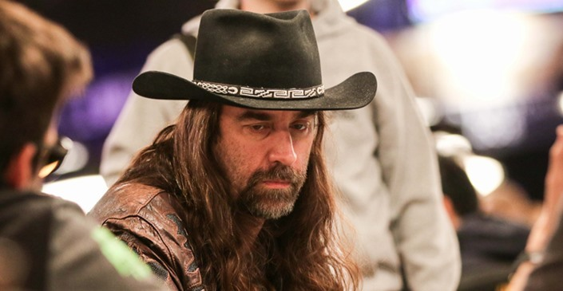

我在Full Tilt Poker（以下简称FTP）里面花了一年的时间做一个试验，我正试图从$0开始赚到$10,000。从一无所有开始，我不得不开始开始玩一些免费比赛。刚开始的时候，我经常赢得一两个美元，但很快又输掉使我不得不重新开始。这花了我很长时间，但终于，我可以升级到参加那些用真钱买入的比赛了。

一直到今天，人们仍然不相信那个坐在FTP低等级桌子上的人就是我。他们经常问我在那边干嘛，然后常常告诉我他们的故事：从$5开始赚到$500或者从$100赚到$1,000。但是，他们的故事通常都以最后破产而告终。这并没有什么好奇怪的，这些家伙通过赌博的方式来迅速建立起他们的资金。他们喜欢参加那些超过他们的资金承受能力的比赛，而当他们碰巧赢了，他们又会立刻升级到更高等级的桌子并且再一次的进行冒险。必然的结果是，他们在几手牌里输光了所有的钱。

对我来说，这项试验并不仅仅关于钱。而是关于向我们大家展示，如何通过进行正确的资金管理，从零开始升级一直到可以玩一些大比赛。我知道这是完全可能的，因为我以前也曾经做到过，从$1开始赚到了$20,000。

为了保证我的资金像处女膜一样的完整，我采用了以下几条策略：

1. 我从来不参加买入费超过我全部资金5%的现金桌和SNG比赛（唯一的例外是刚开始在最低限额的现金桌：我允许自己使用$2.5或更少的买入）

2. 我从来不参加买入费大于我全部资金2%的MTT比赛（唯一的例外是买入为$1的MTT）

3. 当我在任何一张无限（No limit）或底池限注（Pot-limit）桌上的现金超过我资金总额的10%的时候，我会在盲注到达前离开这张桌子

我相信许多玩家执行了这些策略后都做得很好。这些资金管理策略的一个最大的好处就在于它保证你参加那些你能够承受的比赛。你永远不会在那些超过你承受能力的级别玩很长的时间，因为当你开始失败的时候，你将不得不回到更低的级别。当你在低级别提高了你的水平和资金之后你才能拥有向更高级别挑战的机会。这些策略同样可以让你在下风期中免遭灭顶之灾。

降级对于很多玩家来说都是一件很不情愿的事情。他们觉得这是一个很大的失败而且对于他们的情绪也是个很大的打击。大多数人会强行留在高级别并且希望把损失捞回来。但是这会使他们心态严重失衡，而这，可以使他们的资金很快就化为乌有。降级对我来说也是一件很困难的事情，在那次从$1到$20,000的过程中，当我第一次达到$25/$50的级别的时候，我输了很多钱。根据我的原则，我回到了$10/$25的级别。然后我继续了我的连败使我不得不在此降级到$5/$10的级别。这对我来说非常的艰难，在玩过$25/$50以后玩$5/$10会觉得特别的无聊厌烦。

但是我坚持住了自己的原则，而这也同时激励我必须在低级别玩得更好。我真的不想再输，因为我知道再输下去的后果：我将不得不再次降级，这样我回到高级别所花的时间将会更长，这可能会花掉我一个月的时间。如果你回到低级别玩的时候发现自己觉得非常无聊和有挫折感，那显然你不会玩得很好。这个时侯你应该休息一下，有的时候离开扑克一段时间会带给你一些新的想法，并且当你重新回来的时候会给你好好玩下去的动力。

我还有更多的一些关于资金管理方面的心得想和大家分享。首先，你永远也不要因为某个比赛看起来很简单而在超过你资金承受能力的级别玩。因为即使这个比赛再简单，鱼再多也不值得你去冒险而使你的资金处于危机之中。另外一点经验就是当你在低级别还有大把机会盈利的时候，即使你的钱刚好到了升级的要求，也不要轻易去升级。

我非常有信心通过严格遵守这些可靠的资金管理原则，我终将达成我的$10,000的目标。我相信这些原则对于正在追求自己的扑克梦想的你们也一定会很有帮助。

Chris Ferguson个人简介

*5 WSOP Bracelets

*2 WSOP Rings

*National Champion,Heads-Up NLHE 2008

*WSOP Main Event Champion 2000

Chris Ferguson的挑战

2007年的9月，Chris终于达到了从0到10000美金的目标。他遵守了他的承诺，在达到10K的目标后把钱捐献给了儿童救助基金会。
